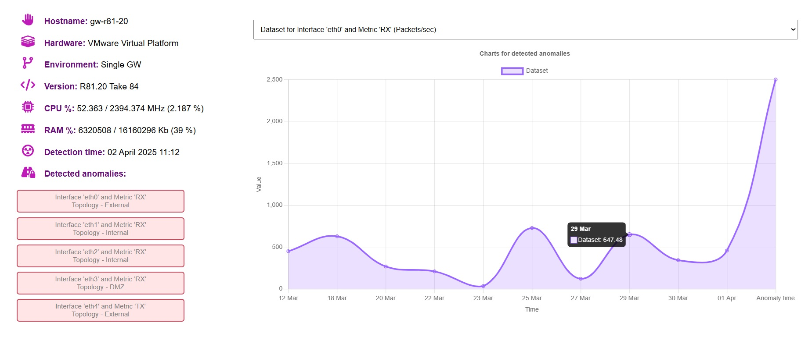

# Автоматизация "Ddos Detector" для CheckPoint NGFW
Образец генерируемого отчёта для версии автоматизации v1.0.4 :

### Часто задаваемые вопросы и ответы:
1. **Что представляет из себя данная автоматизация? :** автоматизация состоит из 3х программ написанных на C/C++ с вставками Bash команд там, где необходимы вызовы проприетарных CLI команд CheckPoint. Сама автоматизация предназначена для детектирования Dos/Ddos атак на NGFW CheckPoint и оповещения об обнаруженных аномалиях по почте или через Telegram.  
2. **Какие поддерживаются версии ОС Gaia? :** работа автоматизации тестировалась мною и коллегами из компании [TS Solution](https://tssolution.ru/) на версии R81.20, в целом всё должно работать на версиях начиная с R81 и новее, но только на "полноценной" Gaia. Gaia Embedded/SMB шлюзы не поддерживаются.  
3. **Почему не предоставляется исходный код? :** основная причина в лицензировании, код не предоставляется чтобы не нарушать лицензирование CheckPoint. А кроме лицензирования есть ещё желание сохранить авторские права :) чтобы части кода не использовали в других проектах или обучении ИИ.  
4. **Каков общий принцип работы детектирования Dos/Ddos у данной автоматизации? :** используется метод "Threshold detection", в качестве метрик выступают значения, снимаемые с сетевых интерфейсов шлюза, такие как пропускная способность (Mbits/sec) и количество пакетов (Packets/sec). Значения метрик за какой-либо конкретный момент сравниваются с максимальными значениями этих же метрик за прошлые 10 дней. Если при сравнении текущее превышает прошлое максимальное на заданный процент, то это аномалия, которая может указывать на атаку.  
5. **Откуда берутся данные метрик за прошлые 10 дней и текущие в моменте? :** данные парсятся из таблиц ядра NGFW, из выводов sar, из базы данных cpview services, часть данных забирается из /sys/class/net/  
6. **Какую нагрузку могут создавать программы автоматизации на RAM/CPU? :** минимальную, программы написаны из расчёта, что они смогут работать даже на перегруженном шлюзе.  
7. **Могут ли программы автоматизации что-либо повредить или нарушить работу NGFW? :** нет, программы автоматизации не изменяют никаких системных файлов или параметров NGFW. Программы автоматизации при необходимости изменяют/перезаписывают только файлы, создаваемые в рабочей директории /usr/bin/ddos_detector.  
8. **Собирается ли какая-то телеметрия? :** нет, автоматизация может взаимодействовать по сети при необходимости, и только с серверами Телеграмм (если Вы настроили отправку оповещений в Ваш бот) или с Вашим почтовым сервером по SMTPS (аналогично Телеграмму, если Вы настроили отправку).  
9. **Какие есть варианты настройки отправки оповещения/отчёта о обнаруженном Dos/Ddos? :** можно настроить отправку в Телеграмм бот и/или по почте.  
10. **Есть ли логирование у данной автоматизации и удаление логов чтобы они не забивали место на диске? :** да, у каждой из трёх программ есть свой лог файл, который автоматически создаётся после первого запуска программы в директории /usr/bin/ddos_detector/logs. Логи не содержат какой-либо приватной информации, за исключением hostname шлюза (в некоторых компаниях есть практика именования из-за которой сразу понятно, что это за компания). Когда размер лога превышает 15 мегабайт он будет перезаписан при следующем запуске программы. Также автоматизация при детектировании Dos/Ddos сохраняет html отчёты в /usr/bin/ddos_detector/reports и, если настроены, образцы дампов трафика во время детектирования в /usr/bin/ddos_detector/reports/traffic_dumps. Автоматически удаляются файлы старше 5 дней.  
11. **Что делать при false positive детектировании или если нашли ошибку в работе автоматизации? :** при false positive необходимо удалить вручную штамп времени в предпоследней строке файла /usr/bin/ddos_detector/data/last_anomalies. Последняя строка в этом файле всегда должна оставаться пустой. Удаление предпоследней необходимо для корректного учёта метрик прошлых 10 дней при будущеющем анализе, т.к. дни зафиксированные в файле last_anomalies не учитываются. 
Если Вы нашли ошибку в работе автоматизации создайте Issue в этом репозитории, постараюсь помочь.  

### Инструкция по конфигурации модуля: ###
 

1. Подключитесь к шлюзу по SSH и войдите в режим Expert. 

2. Далее создайте папку */bin/ddos_detector* с помощью команды:  
**`mkdir /bin/ddos_detector`** 

4. Переместите архив с модулем в папку (скачать его можно [по этой ссылке](https://github.com/sagittarius-H/DdosDetectorForCheckPoint/releases/download/v1.0.4/package_ddos_detector.tar)), подключившись к шлюзу по SFTP, и распакуйте архив:  
**`tar -xvf package_ddos_detector.tar`** 

5. Добавьте разрешение на выполнение исполняемых файлов командой:  
**`chmod +x ddos*`** 

6. Создайте нового пользователя Gaia, который сможет выполнять cron задания, но не будет иметь пароля и возможности подключиться по Web или SSH. Для этого выполните команды на шлюзе из режима Clish:  
**`add user jobuser uid 0 homedir /home/jobuser`** 
**`save config`** 

7. Подключитесь к Web интерфейсу шлюза и перейдите на вкладку User management -> Users. 
Задайте для созданного пользователя Shell = /bin/bash и Role = AdminRole. 

8. Теперь снова вернитесь к SSH подключению, в режим Expert и отредактируйте cron файл для пользователя jobuser командой:  
**`crontab -u jobuser -e`**  
В расписание необходимо вставить следующее:  
**`5 0 * * * /bin/ddos_detector/ddos_stats.run --regular`** 
**`*/5 * * * * cd /bin/ddos_detector && /bin/ddos_detector/ddos_probe.run --regular 25 600`**  
Модуль автоматизации делится на три взаимосвязанные части (блока).  
Блок модуля автоматизации ddos_stats.run должен запускаться раз в сутки и собирать статистику за прошлые 10 дней, когда шлюз был в uptime и не было зафиксировано аномалий, указывающих на возможную атаку.  
Блок модуля автоматизации ddos_probe.run должен запускаться каждые N минут в течение всего дня и проверять метрики интерфейсов (TX, RX, Throughput TX/RX) и метрику Concurrent Connections на аномалию, указывающую на возможную атаку. Аномалией будет считаться превышение метрикой значений этой же метрики за все прошлые дни на заданный процент в течение 5 секунд. В примере выше задан порог = 25%, т.е. аномалией будет считаться значение 125% от всех прошлых метрик, Вы можете задать свой порог исходя из особенностей инфраструктуры и трафика.  
Отслеживание и интерпретация результата каждой метрики занимает не меньше 5 секунд. И хоть в программе оно выполняется параллельно для каждого интерфейса, нужно учитывать это время, поэтому запуск данного модуля чаще чем раз в 5 минут не рекомендуется.  
Для оптимизации Вы можете добавить некоторые интерфейсы в исключения проверки ddos_probe.run, указав их имена по одному на каждой строке в файле */bin/ddos_detector/config/probe_exclusions*. Проверить имена интерфейсов можно с помощью команды Clish: **`clish -c "show interfaces"`**  
Параметр 600 в примере выше обозначает минимальное количество секунд, которое должно пройти с прошлого детектирования, прежде чем программа отправит уведомление в Telegram при повторном детекте.  
Блок модуля автоматизации ddos_alert.run вызывается автоматически при необходимости, добавлять его в cron не нужно. 
9. Теперь необходимо настроить Telegram бот. Откройте диалог с ботом @BotFather и отправьте ему команду:  
**`/newbot`** 
10. Введите название бота. Например, Notifications from CP. После этого @BotFather предложит ввести уникальный username бота, по которому его можно будет найти в Telegram. Оно должно оканчиваться словом "bot". Например, cpwarningsbot. 
11. Сохраните значение токена из ответа. Его необходимо вставить в файл на шлюзе */bin/ddos_detector/config/token_tg* 
12. На последнем шаге настройки уведомлений нужно получить уникальные для каждого пользователя бота идентификаторы чатов. Затем вставить их по одному на каждой строчке в файл на шлюзе */bin/ddos_detector/config/chat_id_tg*  
Получить идентификаторы чатов можно если администратор бота, который знает токен, выполнит в браузере переход по следующей ссылке:
*[https://api.telegram.org/bot<Токен Вашего бота>/getUpdates]()*
13. Опционально или вместо/вместе с отправкой в Телеграмм можно настроить отправку почтой по SMTPS. Для этого в файле */bin/ddos_detector/config/email_conf* укажите следующие данные по одному значению на каждой строке: адрес почтового сервера, порт, email отправителя, пароль оправителя, N строк, где на каждой будет указан по одному email адресу получателя.
14. Опционально можно настроить сбор образцов дампов трафика при детектировании Dos/Ddos. Они будут сжаты в архив вместе с html отчётом и отправлены в Телеграмм/почту. Для этого в файле */bin/ddos_detector/config/sample_conf* укажите количество секунд в течение которых будет собираться дамп трафика. Не рекомендую указывать слишком большое значение, т.к. высока вероятность, что размер дампа будет достаточно большим. По умолчанию автоматизация на уровне кода ограничивает размер дампа до 500 мегабайт и не будет записывать дамп если он потенциально превышает этот порог, а также если на диске шлюза недостаточно места.

